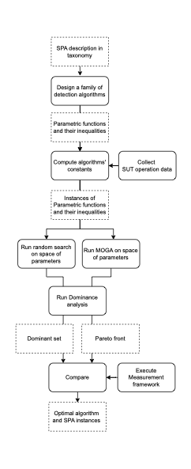

# 
This repository contains the code to replicate the work 

_Multi-objective search to detect Software Performance anti-patterns (SPAs)_

# SPA detection
Execute NSGA-II to determine the optimal values of the parameters of the detection algorithms. It also provide the SPA instances. 

# Project structure
```
SPAdetection/
├── datasets/ 
│   └── dataset_300.csv 
│   └── dataset_250.csv 
│   └── dataset_200.csv
│   └── dataset_150.csv
│   └── dataset_100.csv
│   └── dataset_50.csv
│   └── dataset_2.csv
├── Manager.py
├── GA_RP.py
├── GA_TJ.py
├── GA_CVR.py
├── GA_AH.py
├── utilityFunctions.py
├── detect_ramp.R
├── detect_tj.R
├── detect_cvr.R
├── detect_hiccup.R
├── utilityfunctions.R
└── README.md
```

# Files

Python

_Maneger.py_ masters the execution of MOGA for each SPA considered. 

_Required libraries_
os
pymoo
pandas
csv
multiprocessing

It calls the Python files: 
'GA_RP.py', 'GA_TJ.py', 'GA_AH.py', 'GA_CVR.py'. 

The 'path' field needs points to the folder of the project.

The files to run MOGA for each SPA are:

_Required libraries_  
random  
pandas   
argparse  
numpy  
pymoo  
matplotlib.pyplot  
csv  
subprocess  

_GA_RP.py_ Code to run MOGA and RS and determine the Pareto Front and Dominance Set respectively for the Ramp (RP) antipattern  
_GA_CVR.py_ Code to run MOGA and RS and determine the Pareto Front and Dominance Set respectively  for the Contiuous Violations Requirement (CVR) antipattern  
_GA_TJ.py_ Code to run MOGA and RS and determine the Pareto Front and Dominance Set respectively for the Traffic Jam (TJ) antipattern  
_GA_AH.py_ Code to run MOGA and RS and determine the Pareto Front and Dominance Set respectively for the Application Hiccups (AH) antipattern  
The ranges that define the Design space are hard coded in each of he above files. 
The services of Sock Shop are hard coded in each of the above files  
The utility file _utilitFunctions.py_ contains all the fucnstions used in the above files  
Each of the above Python files  calls the corresponding R file below  

R  

_Required libraries_  
library(stringr)  
library(gridExtra)  
library(grid)  
library(here)  
library(Rmpfr)  
library(xtable)  
library(nls2)  
library(readxl)  
library(optparse)  
library(ggplot2)  
library(RColorBrewer)  

_files_  
detect_hiccup.R  
detect_ramp.R  
detect_tj.R  
detect_cvr.R  

The utility file contains the functions to execute the measurement framework
_utilityFunctions.R_ and creates the datasets list used in the R files
Loads are hard coded in this file.  

# Overview of the approach  


# Data collection
The datasets in this project have been collected with PPTAM https://github.com/pptam/pptam-tool.  
The tool has collected the response times of the operations of Sock Shop demo https://github.com/ocp-power-demos/sock-shop-demo.  
The data contained in the .xan output files have been preprocessed and included in the datasets folder 
